  

  

  
  
  
  

---

## 🌟 Executive Summary & About Me

I am a Computer Science undergraduate at the **Institute of Space Technology (IST)** with professional experience in tech and security workflows at **Electronic Security Company (ESCO.pk)**. 

My journey began with low-level systems and algorithmic foundations in **C++**, before scaling up into **Python-driven Intelligent Systems**, **Distributed Architectures**, and **Modern Full-Stack Applications**. Over recent months, my focus has significantly expanded beyond standalone scripts into **Autonomous Agentic Workflows**, **Physical AI (ROS 2 / Humanoid Robotics)**, **Blockchain Mechanics**, and active explorations into **Quantum Computing**, along with hands-on **Modern Web & Cross-Platform Mobile App Development**.

* 🔭 **Currently Building:** Spec-driven Physical AI learning platforms, full-stack distributed apps, and decentralized systems.
* 🧪 **Exploring New Frontiers:** Quantum Information & Quantum Algorithms, modern cross-platform mobile frameworks, and high-performance Web APIs.
* 🎯 **Core Philosophy:** *Spec-Driven Development (SDD)*, clean architectural patterns, deep algorithmic rigor, and rapid product prototyping.
* 💬 **Ask me about:** Agentic AI (MCP, OpenAI Agent SDK, Claude Code), Physical AI & Robotics, FastAPI, NoSQL/MongoDB, and Distributed Systems.

---

## 🚀 Technical Skills & Arsenal

<table>
  <tr>
    <td valign="top" width="50%">
      <h3>🤖 AI, Machine Learning & Robotics</h3>
      

        
        
        
        
        
        
        
        
        
        
      

      <h3>🌐 Modern Web & App Development</h3>
      

        
        
        
        
        
        
        
        
      

    </td>
    <td valign="top" width="50%">
      <h3>⚛️ Quantum & Emerging Frontiers</h3>
      

        
        
        
        
        
        
      

      <h3>💾 Databases, Systems & DevOps</h3>
      

        
        
        
        
        
        
        
        
      

    </td>
  </tr>
</table>

---

## 🏆 Highlighted Projects & Architectures

### 1. 🤖 [AI-Native Technical Book & Physical AI Platform](https://github.com/coding-with-saad/AI-Nativebook)
> **Live Demo:** [ai-nativebook-three.vercel.app](https://ai-nativebook-three.vercel.app)  
* **Focus:** Physical AI, Humanoid Robotics, Vision-Language-Action (VLA), ROS 2 & Gazebo/Unity Simulation.
* **Architecture:** Spec-Driven technical book built on **Docusaurus**, powered by a continuous **RAG Chatbot** stack (**FastAPI**, **Neon Postgres**, **Qdrant Vector DB**, **OpenAI Agents**) that strictly grounds its responses on the verified manuscript.
* **Tech:** `Python` • `FastAPI` • `Docusaurus` • `Qdrant` • `ROS 2` • `NVIDIA Isaac`

### 2. 🕋 [Smart Hajj Management & Pilgrim Tracking System](https://github.com/coding-with-saad/Smart-Hajj-Management-Pilgrim-Tracking-System)
* **Focus:** End-to-end full-stack web application designed for high-concurrency real-time tracking, administration, and pilgrim safety.
* **Key Features:** Interactive administrative dashboards, automated QR code identity generation, real-time location checkpoints, and secure RESTful database transactions.
* **Tech:** `JavaScript` • `HTML5 / CSS3` • `REST APIs` • `QR Tracking Engine`

### 3. ⛓️ [Blockchain & Distributed Ledger Mechanics](https://github.com/coding-with-saad/Blockchain-)
* **Focus:** Implementation of core blockchain primitives from first principles.
* **Highlights:** Cryptographic hashing routines (SHA-256), immutable ledger construction, proof-of-work consensus mechanisms, and peer-to-peer gossip network mechanics.
* **Tech:** `JavaScript` • `Node.js` • `Cryptography` • `Distributed Systems`

### 4. 🧠 [AI-Powered Task Management & Prioritization System](https://github.com/coding-with-saad/AI-Powered-Task-Management-System)
* **Focus:** Modular CLI task management engine designed with an AI plugin architecture.
* **Highlights:** Dynamically calculates urgency, task dependencies, and context embeddings to recommend optimal workflows and time allocation.
* **Tech:** `Python` • `Spec-Driven Development` • `AI Plugins` • `Clean Architecture`

### 5. 🔌 [Model Context Protocol (MCP) Server & Agent Ecosystem](https://github.com/coding-with-saad/Mcp_Server)
* **Focus:** Next-generation tool calling and context hydration for LLM reasoning engines.
* **Highlights:** Production-grade MCP tools and dynamic resources enabling models to execute local and remote tasks seamlessly.
* **Companion:** [Claude Code Guide](https://github.com/coding-with-saad/claude-code) & [OpenAI Agent SDK Guide](https://github.com/coding-with-saad/Open-Ai-Agent-SDK).
* **Tech:** `Python` • `MCP` • `OpenAI SDK` • `Tool Use / Agent Routing`

### 6. 🗄️ [NoSQL Engineering & MongoDB Mastery](https://github.com/coding-with-saad/Learning-Mongodb-from-scratch)
* **Focus:** Production database management, complex aggregation pipelines, indexing, and schema design.
* **Tech:** `MongoDB` • `NoSQL` • `Node.js / Express Integration`

---

## 📈 Evolution & Recent Expansions (Past 5 Months & Current Focus)

```mermaid
flowchart LR
    A["CS Foundations (C++ / DSA)"] --> B["Python & Data Systems (NumPy / OOP)"]
    B --> C["Agentic AI & RAG (FastAPI, Qdrant, MCP)"]
    C --> D["Physical AI & Robotics (ROS 2, Isaac, VLA)"]
    D --> E["Full-Stack Web & App Development"]
    E --> F["Blockchain & P2P Networks"]
    F --> G["Quantum Computing & Algorithms (Current Frontier)"]
    
    style A fill:#252525,stroke:#444,stroke-width:1px,color:#fff
    style B fill:#1e3a5f,stroke:#2b5c8f,stroke-width:1px,color:#fff
    style C fill:#134e48,stroke:#14b8a6,stroke-width:1px,color:#fff
    style D fill:#4c1d95,stroke:#8b5cf6,stroke-width:1px,color:#fff
    style E fill:#831843,stroke:#f43f5e,stroke-width:1px,color:#fff
    style F fill:#78350f,stroke:#f59e0b,stroke-width:1px,color:#fff
    style G fill:#064e3b,stroke:#10b981,stroke-width:2px,color:#fff
```

* **⚛️ Quantum Information & Computing:** Exploring qubits, quantum superposition/entanglement, quantum circuit simulation with Qiskit, and algorithmic paradigms (Shor's, Grover's).
* **📱 Modern Mobile & Cross-Platform App Engineering:** Crafting intuitive, cross-platform apps with smooth state management, offline persistence, and seamless API synchronizations.
* **🌐 End-to-End Modern Web Architecture:** Building responsive, ultra-fast web interfaces paired with robust backend services, microservices, and database pipelines.
* **🤖 Autonomous Multi-Agent Workflows:** Specifying workflows where multiple autonomous agents cooperate with human-in-the-loop oversight.

---

## 📊 GitHub Analytics & Activity

  
  

  

---

## 🤝 Let's Connect & Collaborate

I am always keen to collaborate on **innovative software engineering**, **AI research**, **distributed systems**, and **open-source ventures**.

  
  &nbsp;
  
  &nbsp;
  

  Designed with precision & passion • Malik Saad Khawar

